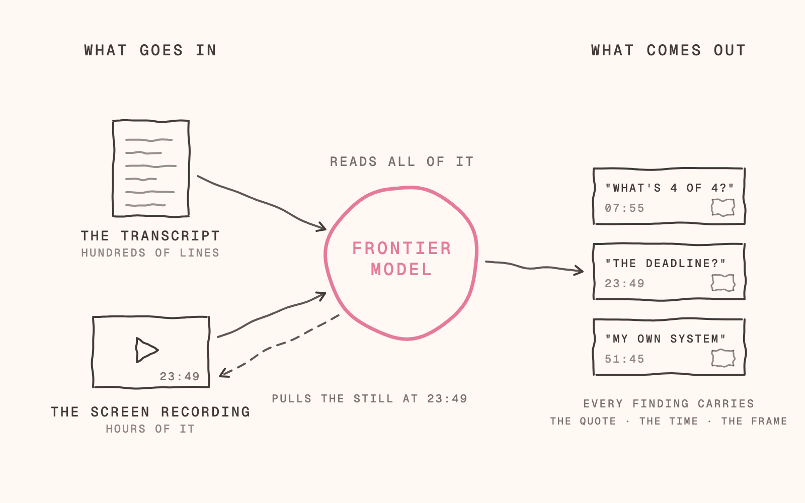

# User testing kit

Drop a screen recording and its transcript into a folder. An AI coding agent reads the whole transcript, looks at the whole session, pulls the exact still at every moment that matters, and writes findings that cite the quote, the time and the frame.

This is the method I used to analyse a round of user-testing sessions for an accountancy practice in September 2026, written down so you can fork it and run it on your own research. It needs ffmpeg, a transcript, and whatever coding agent you already use: Claude Code, Codex, Cursor, anything that can run a shell command and look at an image.

**What it is not.** The agent does not watch video. It reads the transcript, samples the screen, pulls stills where the transcript says something happened, and then looks at those stills. That is the honest version, and it is the version that works: the judgement stays with the model and with you, and the mechanical part is two short shell scripts.

## Quick start

1. Install ffmpeg (`brew install ffmpeg` on a Mac).
2. Clone this repo.
3. Make a folder per session in `sessions/` and put two files in it: `recording.mp4` and `transcript.txt`. Copy `templates/meta.json` in as `meta.json` and fill in the participant's name and initial.
4. Open your coding agent in the repo and say: **"Read CLAUDE.md, then analyse the sessions in `sessions/`."**
5. Read what it writes in `findings/`. Argue with it. Every claim carries a time and a frame, so you can check any of them in seconds.

A finished run looks like [`example/`](example/): a staged session, its contact sheet, the frames the agent pulled, and the three documents it wrote.

## The method

**The loop.** Form a hypothesis. Put a real interface in front of real people, loaded with fictional data so nothing can go wrong ([`prompts/00-dummy-deployment.md`](prompts/00-dummy-deployment.md)). Record the screen and the conversation. Let the agent analyse it. Build from the two documents it writes. Test again.

**Say and do are different.** People tell you one thing and click another. The transcript holds what they said; the recording holds what they did. A finding is only solid when it has both, which is why every citation in this kit names a quote, a time and a frame.

**Per session, the agent:**

1. Runs `bin/contact-sheet.sh` and reads every sheet in one message, so it has seen the whole session before it chooses anything.
2. Reads the whole transcript.
3. Measures the offset between transcript and recording, once, and writes it to `meta.json` (below).
4. Chooses the moments: hesitations, misreadings, "what does this mean?", doing something other than what they said, workarounds, the things they liked.
5. Runs `bin/frames-at.sh` for those moments and looks at each frame. If a frame is a second early or late, it pulls again.
6. Writes the findings using the prompts in `prompts/`.

The full brief is [`CLAUDE.md`](CLAUDE.md).

**The offset.** The transcript's clock and the recording's clock almost never start together: a transcription tool joins the call at one moment, the record button is pressed at another. On my sessions the gap was around thirty seconds and different every time. Measure it once per session: find one distinctive moment you can see or hear (a click, a page change, a phrase), note its time in the transcript and its time in the recording, and put the difference in `meta.json` as `offset_seconds` (recording time minus transcript time). `frames-at.sh` applies it. Skip this and every frame you pull is from the wrong moment.

## Conventions

- **Folders:** `sessions/YYYY-MM-DD-HHMM-firstname-lastname/` with `transcript.txt`, `recording.mp4`, `meta.json`. Date and start time are the calendar slot, so sessions sort in order.
- **Frames:** `<INITIAL>-<mmss>-<slug>.jpg` in transcript time, e.g. `P-0022-backlog-label.jpg`.
- **Citations:** `Name m:ss–m:ss (P-0022)`: the name, the span in the transcript, the frame id. Quote the words as said.
- **Outputs:** `findings/01-strategy-read.md` (what the sessions showed and what to build), `findings/02-bugs-and-small-fixes.md` (sized, routed, cited, ready for a second agent to work through), `findings/03-problem-register.md` (every problem, numbered, with where it was solved).
- **Raw stays raw.** Transcripts and recordings are never edited. Findings live in their own files and point back.

## Transcripts

Any transcript with a timestamp at least once per speaker turn works. The agent reads it as text; nothing is parsed.

- **whisper.cpp or mlx-whisper** (open, free, runs locally): `whisper-cli -osrt recording.mp4`, or `mlx_whisper recording.mp4 --output-format srt`. The default here, so a fork costs nothing.
- **Otter** (what I used): export as text. Blocks of `Speaker  m:ss` then the words.
- **ElevenLabs Scribe**: word-level timestamps and speaker labels. The best timing; paid.

## Privacy

- Get consent to record and say what the recording is for.
- Never commit a real participant's recording or transcript to a public repo. Both are git-ignored under `sessions/` here.
- Before anything leaves the team, anonymise: names, client names, anything on screen that identifies a person.
- The example in this repo is staged: a fictional interface, a scripted participant, no real practice anywhere in it.

## What is in the repo

| Path | What |
|---|---|
| `CLAUDE.md` | The agent brief: the procedure, the rules, the output formats. `AGENTS.md` points here for other agents. |
| `bin/contact-sheet.sh` | One frame every N seconds, tiled into numbered sheets, with an index of every cell's time. |
| `bin/frames-at.sh` | The exact still at each moment, offset applied, named for citation. |
| `prompts/` | The three prompts: the dummy deployment, the strategy read, the bugs and small fixes. |
| `templates/` | `meta.json` and the shape of the problem register. |
| `example/` | A complete staged run, end to end. |
| `sessions/` | Yours. |

## How this was built

The method came first, the code second. In September 2026 I ran a round of user-testing sessions with an accountancy practice on a real interface loaded with fictional data. Each session gave me a Google Meet recording and an Otter transcript. An AI agent read every transcript, decided which moments mattered, pulled a still from the recording at each one, looked at the still, and wrote the findings with the quote, the time and the frame. Two documents came out per sprint: a strategy read, and a bug list that went straight to a second agent to fix.

There was no script. The frame pulls were ad hoc commands, and the offset between each transcript and its recording was measured by hand. This repo is that method written down, plus the two small scripts that make it repeatable.

The frame-sampling step comes from a video pipeline I built in July 2026 for weekly videos. Before writing it, six research agents surveyed about thirty tools, then three candidates were run on the same footage and measured. The reference implementation, browser-use/video-use, had the right shape and the wrong details for my footage, so the verdict was **steal the architecture, own the code**: keep the idea, write the two hundred lines you understand. That is the spirit of this kit too. It is small, it needs ffmpeg and a transcript, and the judgement stays with the agent and with you.

## Thank you

The ideas here are borrowed, with gratitude, from people who published theirs.

- [browser-use/video-use](https://github.com/browser-use/video-use) (MIT) — the spine: a transcript the model reads, a reasoned plan with a rationale per decision, dumb code that executes it, and a self-check that looks at frames afterwards.
- [assafkip/claude-video-editor](https://github.com/assafkip/claude-video-editor) — the sentence that unlocked it: *"Claude never watches the video frame by frame. It reads it."*
- [kwindla/skill-caption-clip](https://github.com/kwindla/skill-caption-clip) — clean the transcript before you use it.
- [6missedcalls/video-editing-skill](https://github.com/6missedcalls/video-editing-skill) (MIT) — proof the whole thing runs on bash, ffmpeg and Whisper with nothing paid.
- [digitalsamba/claude-code-video-toolkit](https://github.com/digitalsamba/claude-code-video-toolkit) (MIT) — one skill per stage, never one mega-skill.
- [ffmpeg](https://ffmpeg.org), [whisper.cpp](https://github.com/ggml-org/whisper.cpp) and [mlx-whisper](https://github.com/ml-explore/mlx-examples) — the open tools that do the mechanical work.
- ElevenLabs Scribe and Otter — the paid transcribers I actually used. Whisper is the default here so a fork costs nothing.

Nothing in this repo is a fork of any of them. If you find your idea here uncredited, open an issue and I will add you.

## Licence

MIT. No maintenance is promised: this exists so a method I use can be checked and copied. Issues are welcome; replies are not guaranteed.
